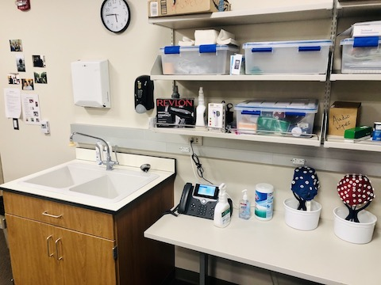
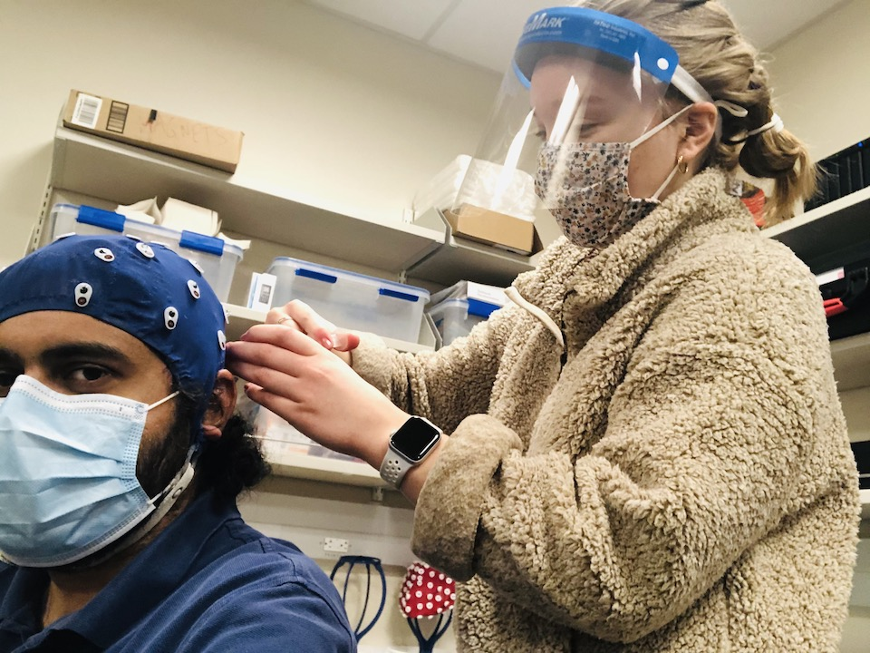
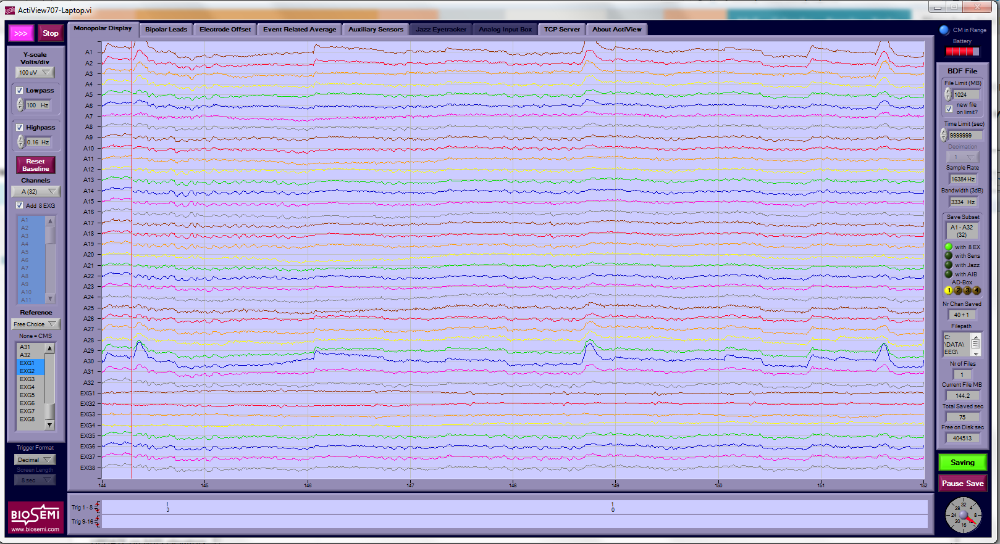
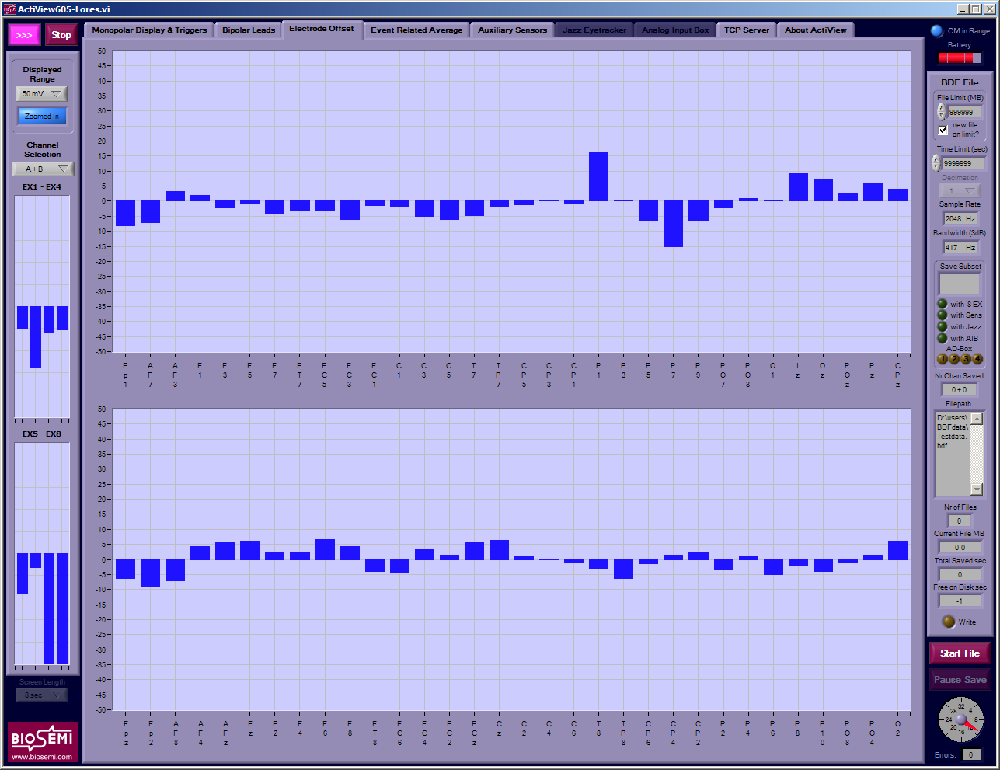
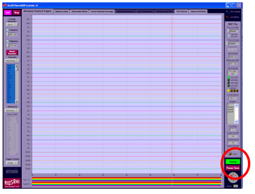
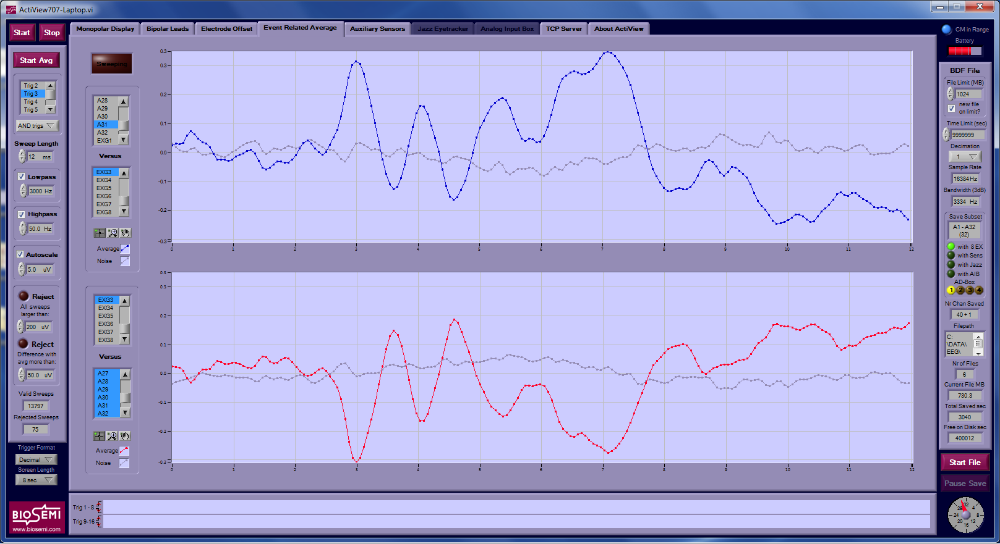
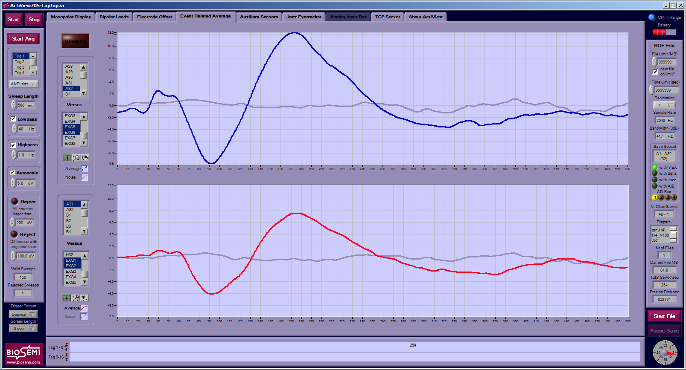

# EEG scanning protocol at Purdue SNAPlab

These would apply for ABRs, EFRs, and cortical EEG measurements.

## Before the subject arrives

1.  Follow all COVID-specific protocols
    (Qualtrics survey for subject within 48 hours before, temperature check in the lobby,
    ensuring mask usage, etc.)
1.  Instruct the subject to avoid using any hair products on the day
    they are coming in for the scan.
2.  Test the stimulus delivery (make sure things look and sound like
    they are supposed to)
3.  Make sure that printed current consent forms are available and that
    they match what you need for the study. The current protcol number
    is 1609018209.
4.  Check lab secure database (SubjectContact.xlsx) to see if subject has already been
    consented. If not, issue a new subject ID and add their contact info.
7.  Make sure the sampling rate dial is set to the desired rate (e.g.,
    \"4\" for 2048 Hz, \"5\" for 4096 Hz, \"7\" for 16384 Hz).
    We typically use 16384 Hz for ABR or subcortical responses if we are
    interested in transient features, 4096 Hz for most else.
    For purely cortical responses, 2048 is reasonable.
8.  Disinfect work surface with wipes and prepare set of electrodes and
    syringes by laying them out on a clean surface, possibly with paper towels.
    Do **not** fill syringe with gel yet, wait until subject is actually here to do so.

## Once the subject is here

1.  Consent subject if not already done or unsure: This involves
    describing what the experiment entails, what the risks are, what the
    compensation amount is, giving info about who to contact in case of
    any subject concerns., etc.
2.  Remind subjects about using the restroom before prepping them for
    EEG
3.  Prepare subject, describe task (if any), collect data (see below).
    In describing the task/stimuli, be sure to mention any sounds that
    might potentially be startling if unexpected (e.g., MEMR elicitor).
    Run DEMO version of task, if applicable.

### EEG cap setup

1.  Make sure that the subject\'s hair/head is dry (we have hair dryers
    if we need them) and is free of obvious products.
1.  Measure head circumference and choose cap size accordingly based on
    the cap size indicated on the tag. If the head circumference is at
    the edge of the range of sizes indicated on the cap, err on the side
    of using a smaller cap. eg: 58 cm =\> use the 54-58 cap rather than
    the 58-62.
2.  Align cap such that the electrode Cz (\#32 on the 32 channel cap) is
    at the vertex, i.e., halfway between the nasion and the inion and
    halfway between the left and right auricular points. Look from
    directly in front of the subject to see if Fz, Cz and Pz are roughly
    on a straight line.
3.  Clean external electrode sites with alcohol wipes. This usually
    includes reference sites, external sites to measure eyeblinks etc.
    It is not necessary clean any areas covered by hair. It is useful to
    wipe even regular EEG sites when they are not covered by hair (e.g.,
    on the forehead).
4.  If the reference electrode is under the cap (e.g., mastoid bone),
    apply them first. Then tighten the chinstrap. On the other
    hand, if the references are in front of the cap (e.g., earlobes),
    save the references for the last (i.e., just before CMS-DRL).
5.  Once the cap is on and secured and you have applied any electrodes
    that go under the cap, run head digitization, if applicable,
    following the protocol. We will do this for cortical EEG
    experiments where we are interested in source localization, 
    and typically not for ABRs and EFRs.
5.  For most of the prep, and especially for affixing electrodes to the cap,
    it is best to stand behind and slightly to the left of the subject.
    That way, most cables will tend to come out to the subject's left.
    That makes it easier to end up with a bundle to attach to the amp which
    will be on the subjects left inside the booth.

6.  Inject electrolyte gel into the slots on the cap:
    -   Use the syringe tip to gently part the hair so that the
        gel makes contact with the scalp.
        It is not necessary to abrade the scalp.
    -   **Start** pistoning out the gel with the tip touching the scalp
        but draw the syringe out as you squirt gel. That way the syringe
        doesn't pull our the gel with it.
    -   It is good practice to ask the subject if they felt cold gel,
        especially in areas where there is more hair.
    -   There are two opposing considerations to keep in mind when applying
        gel: Too little gel may not allow for forming stable contact,
        but too much gel runs the risk of bridging two different channels!
    -   The DRL site is especially important to get a really nice contact.
7.  Once all the electrodes are \"gel\"-ed, affix the electrodes in
    order (ascending or descending). It is useful to follow the bunching
    order that the electrode set inherently has.
8.  Affix external reference channels if any: Use the double sided round
    sticker. Make sure to expose the metal contact when sticking the
    sticker on. Apply the electrolyte gel on the contact avoiding the
    glue area. Affix the channel on the subject.
    Use micropore tape as needed to stabilize the fixture. Make sure
    to note which electrode was attached to which site (e.g., left vs.
    right) so that they can be inserted into the correct slot on the
    amplifier. Our convention is to use:
    -   EXG1 for left earlobe [or mastoid, but earlobe preferred]
    -   EXG2 for right earlobe [or mastoid, but earlobe preferred]
    -   EXG3 for left tiptrode (if using)
    -   EXG4 for right tiptrode (if using)
9.  Attach CMS+DRL. Gather all the other electrodes in a bunch and coil
    the CMS+DRL wires around the bunch at least 5 times, finally
    securing them with the velcro band. The coiling makes external
    capacitively-coupled sources of interference be more part of the
    common-mode and less differential, helping take advantage of
    Biosemi\'s active CMRR (e.g., reduced 60 Hz noise).
10. Escort the subject into the sound booth and attach the electrodes in
    the appropriate slots on the amplifier. One useful convention to
    follow is to always attach the left reference electrode to EXG1 and
    right to EXG2.
11. Turn the amp on and make sure that the blue and the green lights are
    on and steady (indicating that the battery, and the CMS+DRL contacts
    are good).

### Data acquisition software setup

1.  Start the ActiView program and choose a configuration file if
    prompted. We have a default config file that should be loaded
    automatically. So you shouldn't typically be prompted.

2.  Hit the start button on the top left. You should see a stream of
    data coming in.
3.  Check that the sampling rate displayed on the right matches what you
    want.
4.  For convenience, subselect the channels you want to view (e.g.,
    A1-32, ExG1-8). It is also useful to view the data already
    referenced to the reference channels: This is done by selecting
    \"Free Choice\" under the reference drop-down menu and then clicking
    the reference(s) (e.g., EXG1 and EXG2 (shift+click for multiple)).
5.  It is useful to view the Tigger in \"Decimal\" format by setting so
    on the \"Trigger Format\" drop down. Choosing the decimal format
    displays the trigger edges (as opposed to their steady default
    values) as an easy to read integer that will match the trigger
    number sent in by the stimulus program (for our hardware setup).
6.  Switch to the \"Electrode Offset\" tab to check on whether the
    contacts are good enough. Typical standard for a good contact is a
    steady offset of under 20 mV or so. It is useful to set the scale to
    +/- 50mV by selecting \"50 mV\" from the \"Displayed Range\"
    dropdown menu. It is also useful to select only the channel you are
    interested in viewing. Remember to also look at ExG channels on the
    left.

7.  If the offset is too high or fluctuating rapidly, reapply gel to the
    electrode. If one of the bad channels is an ExG channel (or say a
    channel on the forehead), you could also try cleaning (with alcohol)
    and reapplying the electrode.
8.  Go back to the \"Monopolar Display & Triggers\" tab and eye-ball the
    channels to see if they look roughly OK.
9.  Rarely, you may find that a certain channel (or few) are not fixable
    (quickly enough). Just go ahead with the recording (unless too many
    are bad) and make note of the bad channel numbers for the record.
10. Once you are satisfied with the electrodes and the rest of the
    setup, click \"Start File\". You will be prompted with an error
    message (because you are yet to choose a file location). Once you
    \"Ok\" the error, you will be prompted to choose a file name.
    Navigate to the directory where you want the data to be stored and
    choose a filename approapriate to the experiment and whatever naming
    conventions you have. You\'ll also be prompted to select which
    channels to save, save only the channels that you are recording
    (e.g., A1-A32, add EXG1-8). Do not check the box that says \"add
    displayed channels\" as that will save an additional copy of
    whatever you are viewing.
11. If you plan to run a long session without manually intervening, it
    is useful to set file size limits in the \"File Limit (MB)\" field
    on the top right (e.g., 500 MB is a good size limit). Otherwise you
    may end up with one big file exceeding 2 GB.
12. If the stimulus delivery program does not automatically start and
    stop the *saving* of data to disk, you should at this time start
    saving manually by clicking on the \"Paused\" button on the bottom
    right. If data is being saved, you should see a green \"Saving\"
    button!

13. Once the setup is ready and the subject is ready, start the stimulus
    program. Make sure that the data is being saved and that triggers
    are thrown (you should see numbers corresponding to events along the
    decimal trigger channel).
14. Setup online averaging on the \"Event Related Averaging\" tab to see
    real-time accumulation of triggered-averaged evoked responses. This
    is just for us to get a sense of data quality during acquisition.
    The raw data is saved anyway and offline analysis can be optimized
    as desired in the particular experiment. To set the online
    averaging, choose the electrode pair, the volatge across which you
    want to view. The way the labview VI is programmed, note that the
    reference electrode in the pair could be the average of several
    electrode: For instance, in the image below, in the top panel, the
    reference is EXG3 (the ear-canal electrode of Tiptrode in this
    case), and the other lead in the pair is A32 (which is the Cz
    location). On the other hand, in the botoom panel, the reference is
    the average of A1 to A32 (although only A31 and A32 are in view in
    the screenshot), and the tiptrode (EXG3) is the other active lead.

15. To choose which events to average online, the Trg bits (in the top
    left) have to be set. The VI is programmed to consider events on a
    bit by bit basis on the digital channel. You can use logical \"AND\"
    or \"OR\" operations to combine bits. In the example images above,
    you can see different filtering and window durations being applied
    to get online averages for ABRs and cortical N100s respectively.
