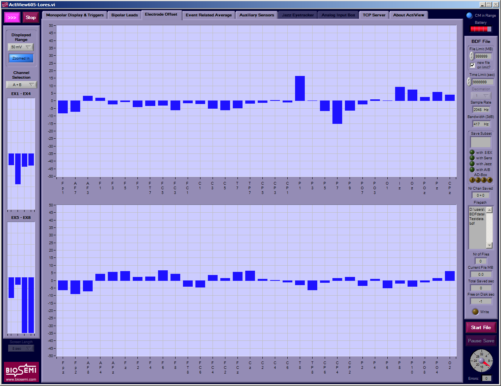

EEG scanning protocol at BU ANL
===============================

Before the subject arrives
--------------------------

0. Schedule audiogram for subject on
   the HearingScreenings google calendar.
   If you don't know the password, 
   ask someone.
   
1. Instruct the subject to avoid
   using any hair products on the day
   they are coming in for the scan.

2. Test the stimulus delivery
   (make sure things look and sound
   like they are supposed to)

3. Make sure current consent forms
   are available and that they match
   what you need for the study
   (i.e., EEG vs. Behavioral, 
   Normal Hearing vs. HI).

4. Make sure that the subject has
   undergone a hearing test within
   the past year.

5. Prepare a set of electrodes and
   syringes

6. Go back to the records to see if
   the subject has already been
   consented. Follow the protocol
   for accessing the database.

7. Make sure the sampling rate dial
   is set to the desired rate (e.g.,
   "4" for 2048 Hz, "5" for 4096 Hz,
   "7" for 16384 Hz).

8. Make sure that the desired configuration
   file exists on the EEG acquisition computer.

Once the subject is here
------------------------

1. Consent subject if not already done
   or unsure: This involves describing
   what the experiment entails, what the
   risks are, what the compensation amount is,
   giving info about who to contact
   in case of any subject concerns., etc.

2. Remind subjects about using the restroom
   
3. Prepare subject, describe task (if any),
   collect data (see below). In describing
   the task/stimuli, be sure to mention
   any sounds that might potentially be
   startling if unexpected.

EEG cap setup
+++++++++++++

0. Make sure that the subject's hair/head is dry 
   (we have hair dryers if we need them) and is free
   of obvious products.

1. Measure head circumference and choose cap size
   accordingly based on the cap size indicated on the tag.
   If the head circumference is at the edge of the range of sizes
   indicated on the cap, err on the side of using a smaller cap.
   eg: 58 cm => use the 54-58 cap rather than the 58-62.

2. Align cap such that the electrode Cz (#32 on the 32 channel cap)
   is at the vertex, i.e., halfway between the nasion and the inion
   and halfway between the left and right auricular points.
   Look from directly in front of the subject to see if Fz, Cz 
   and Pz are roughly on a straight line.

3. Clean external electrode sites with alcohol wipes. This
   usually includes reference sites, external sites to measure
   eyeblinks etc. It is not
   necessary clean any areas covered by hair. 
   Sometimes, it is useful to wipe even regular EEG sites when they 
   are not covered by hair (e.g., on the forehead).

4. If the reference electrode is under the cap (e.g., mastoid bone),
   apply them first (see 7). Then tighten the chinstrap. On the other hand,
   if the references are in front of the cap (e.g., earlobes),
   save the references for the last.

5. Inject electrolyte gel into the slots on the cap. It is only
   necessary to gently part the hair so that the gel makes contact
   with the scalp. It is not necessary to abrade the scalp.

6. Once all the electrodes are "gel"-ed, affix the electrodes in order
   (ascending or descending). It is useful to follow the bunching order
   that the electrode set inherently has.

7. Affix external reference channels if any: Use the double sided
   round sticker. Make sure to expose the metal contact when sticking the
   sticker on. Apply the electrolyte gel on the contact avoiding the glue
   area. Affix the channel on the subject. If it seems like the electrode
   might be unstable, use micropore tape as needed. Make sure to note
   which electrode was attached to which site (e.g., left vs. right)
   so that they can be inserted into the correct slot on the amplifier.

8. Attach CMS+DRL. Gather all the other electrodes in a bunch and coil
   the CMS+DRL wires around the bunch at least 5 times, finally securing them
   with the velcro band.

9. Escort the subject into the sound booth and attach the electrodes in the
   appropriate slots. One useful convention to follow is to always attach the
   left reference electrode to EXG1 and right to EXG2.

10. Turn the amp on and make sure that the blue and the green lights are on
    and steady (indicating that the CMS+DRL contacts are good).
    
.. image:: amplifier.gif

Data acquisition software setup
+++++++++++++++++++++++++++++++

1. Start the ActiView7xx program and choose a configuration file when prompted.

.. image:: actiview.jpg

2. Hit the start button on the top left. You should see a stream of data coming in.

3. Check that the sampling rate displayed on the right matches what you want.

4. For convenience, subselect the channels you want to view (e.g., A1-32, ExG1-8).
   It is also useful to view the data already referenced to the reference channels:
   This is done by selecting "Free Choice" under the reference drop-down menu
   and then clicking the reference(s) (e.g., EXG1 and EXG2 (shift+click for multiple)). 

5. It is useful to view the Tigger in "Decimal" format by setting so on the "Trigger
   Format" drop down. Choosing the decimal format displays only trigger "edges" as opposed
   to their steady default values.

6. Switch to the "Electrode Offset" tab to check on whether the contacts are good enough.
   Typical standard for a good contact is a steady offset of under 20 mV or so. It is
   useful to set the scale to +/- 50mV by selecting "50 mV" from the "Displayed Range"
   dropdown menu. It is also useful to select only the channel you are interested in viewing.
   Remember to also look at ExG channels on the left.

7. If the offset is too high or fluctuating rapidly, reapply gel to the electrode. If one 
   of the bad channels is an ExG channel (or say a channel on the forehead), you could also try cleaning (with alcohol) 
   and reapplying the electrode.

8. Go back to the "Monopolar Display & Triggers" tab and eye-ball the channels to see if they look
   roughly OK.

9. Sometimes, you may find that a certain channel (or few) are not fixable (quickly enough). Just
   go ahead with the recording (unless too many are bad) and make note of the bad channel numbers for the record.

10. Once you are satisfied with the electrodes and the rest of the setup, click "Start File". You
    will be prompted with an error message (because you are yet to choose a file location). Once
    you "Ok" the error, you will be prompted to choose a file name. Navigate to the directory
    where you want the data to be stored and choose a filename approapriate to the 
    experiment and whatever naming conventions you have.

11. If you plan to run a long session without manually intervening, it is useful to set
    file size limits in the "File Limit (MB)" field on the top right (e.g., 500 MB is a
    good size limit). Otherwise you may end up with one big file exceeding 2 GB.

12. If the stimulus delivery program does not automatically start and stop the *saving*
    of data to disk, you should at this time start saving manually by clicking on the
    "Paused" button on the bottom right. If data is being saved, you should see 
    a green "Saving" button.

13. Once the setup is ready and the subject is ready, start the stimulus program. Make sure
    that the data is being saved and that triggers are thrown (you should see numbers corresponding
    to events along the decimal trigger channel).

